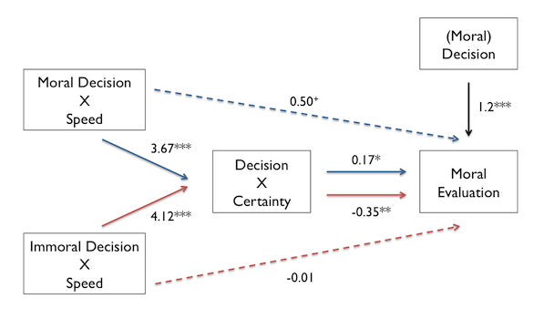

<style>div.comment {color:blue}</style>
---
title: "Analysis Code for Replication of Critcher et al. (2013)"
output: html_document
---

```{r import_libraries, echo = FALSE, message=FALSE, warning = FALSE}
library("jsonlite")
library("tidyr")
library("dplyr")
library("ggplot2")
library("lme4")
library("lmerTest")
library(boot)
library(bootstrap)

sem <- function(x) {sd(x) / sqrt(length(x))}
ci95 <- function(x) {sem(x) * 1.96}

theta <- 
  function(x,xdata,na.rm=T) {mean(xdata[x],na.rm=na.rm)}

ci.low <- 
  function(x,na.rm=T) {mean(x,na.rm=na.rm) - quantile(bootstrap(1:length(x),10000,theta,x,na.rm=na.rm)$thetastar,.025,na.rm=na.rm)}

ci.high <- 
  function(x,na.rm=T) {quantile(bootstrap(1:length(x),10000,theta,x,na.rm=na.rm)$thetastar,.975,na.rm=na.rm) - mean(x,na.rm=na.rm)}
```

Reported here are the results from the replication of Critcher et al. (2013). This replication was conducted by Yuan Chang Leong as part of the course requirements of PSYCH254: Lab in Experimental Methods, taught by Professor Michael Frank at Stanford University, Winter Quarter 2014/2015.   

Participants read a vignette about two targets, Justin and Nate, who chose to act either morally (moral condition) or immorally (immoral condition). Justin made his decision quickly, while Nate made his decision slowly. We had participants rate the moral character of Justin and Nate, and investigated if decision speed influenced judgments of moral character. For more information, please see the written report [here](http://web.stanford.edu/~ycleong/Projects/PSYCH254/Project/YLEONG_ReplicationReport.pdf). You can also access the experimental task [here.](http://web.stanford.edu/~ycleong/Projects/PSYCH254/task_jsPsych/MCP.html) <br>

119 participants were recruited from Amazon Mechanical Turk. 56 participants were randomly assigned to the moral condition and 63 were randomly assignned to the immoral condition.  

First, let's load in the data:
```{r}
d.tidy = read.csv("d.tidy.csv")
head(d.tidy)
```

Manipulation Check  
-------------------
Immediately after reading the vignette about Justin and Nate, participants rated how quickly Justin and Nate made their decision. Participants made the ratings again at the end of the experiment. These ratings served as our manipulation checks to ensure that participants were aware of the speed manipulation in our experiment. 

```{r Manipulation check, fig.width = 5, fig.height = 5, fig.align='center'}
# Manipulation Check 1
MC1 = d.tidy %>% filter(Question == "MC1") %>%
  group_by(Speed) %>%
  summarise(Avg = mean(Response),CI = ci95(Response))
MC1$Order = "Start";

# Manipulation Check 2 
MC2 = d.tidy %>% filter(Question == "MC2") %>%
  group_by(Speed) %>%
  summarise(Avg = mean(Response),CI = ci95(Response))
MC2$Order = "End";

MC = bind_rows(MC1,MC2)
MC$Order = factor(MC$Order,levels = c("Start","End"))

# Plot
ggplot(MC, aes(x=Speed, y=Avg)) + 
  geom_bar(stat="identity",width=0.5) +
  geom_errorbar(aes(ymax = Avg + CI, ymin= Avg - CI), width=0.15) +
  facet_grid(~ Order) + 
  ylab("How quickly was the decision made? 1 = Slow, 7 = Quick") 
```

**Figure 1. Speed ratings of Justin (Quick) and Nate (Slow).** **left.** Ratings at the start of the experiment. **right.** Ratings at the end of the experiment. In both cases, quick Justin was rated as having made his decision more quickly than slow Nate. Error bars denote 95% confidence intervals as computed using a bootstrapping procedure with 10000 iterations.

Let's use a paired t-test to formally test if participants rated Quick Justin as acting more quickly than Slow Nate.  

```{r}
# T-test for MC 1
MC1 = d.tidy %>% filter(Question == "MC1") 
t.test(Response~Speed,MC1,paired = TRUE)

# T-test for MC 2
MC2 = d.tidy %>% filter(Question == "MC2") 
t.test(Response~Speed,MC2,paired = TRUE)
```

In both cases, quick Justin was rated as having made his decision more quickly than slow Nate (Fig. 1, at the start of the experiment: t(119) = 31.32, p < 0.001, at the end of the experiment t(119) = 30.93, p < 0.001)

We used the manipulation checks to exclude subjects. While the original study did not exclude any subjects, we will be more stringent with the participants we include in the replication due to the heterogeneity of the sample on mechanical turk. Subjects had to rate Justin as faster than Nate on both manipulation checks to be included in the study.  

```{r}
Pass2 = spread(MC2,Speed,Response) %>%
  mutate(Pass2 = Quick > Slow)

Pass = spread(MC1,Speed,Response) %>%
  mutate(Pass1 = Quick > Slow) %>%
  select(c(SubID,Pass1)) %>% 
  left_join(Pass2,by = "SubID") %>%
  select(SubID,Pass1,Pass2) %>%
  mutate(Passed = Pass1 & Pass2)
  
included = Pass$SubID[Pass$Passed] 
  
cat(sum(Pass$Passed),paste("subjects included."),sum(!Pass$Passed),paste("subjects excluded."))
```
  
4 subjects were excluded to yield a final sample of 53 participants assigned in the moral condition and 62 participants in the immoral condition. 

Decision X Speed Interaction
-------------------
To investigate the effect of decision and decision speed on moral evaluation, we plotted participants’ moral evaluations of the target by decision and decision speed (Fig. 2)

```{r fig.width = 4, fig.height=5,fig.align='center'}
# Exclude Subject
d.included = d.tidy %>% filter(SubID %in% included)

# Subset only the averages
d.moral = d.included %>% 
  filter(Question == "M.avg")

d.moral.summary = d.moral %>% 
  group_by(Decision,Speed) %>%
  summarize(Avg = mean(Response), 
            CI = ci95(Response),
            ci.low = ci.low(Response),
            ci.hi = ci.high(Response)
            )

# Plot means by decision by speed
ggplot(d.moral.summary, aes(x=Decision,y=Avg,fill=Speed)) +
  geom_bar(stat="identity", position=position_dodge()) +
  geom_errorbar(aes(ymax = Avg + ci.hi, ymin =Avg - ci.low), width=.2, position=position_dodge(.9)) +
  ylab("(Positive) Moral Character Evaluation") +
  coord_cartesian(ylim = c(2, 7)) +
  theme(legend.position="top")
```

**Figure 2**. Moral character evaluation by decision and speed. Error bars denote 95% confidence intervals. 

The plot suggests that there is a Decision X Speed interaction on Moral Evaluation. Let's formally test this using a linear mixed effects model.  

Note that the original study modeled moral evaluation using a mixed anova. However, because our dataset isn't balanced, I decided against using a mixed anova. Technically, I could figure out a way to use Type III sum of squares, and the mixed anova would still be valid, but I thought it would be more straightforward to switch directly to a linear mixed effects model. 

```{r}
d.moral$SubID = factor(d.moral$SubID)
contrasts(d.moral$Decision) = c(-1,1)
contrasts(d.moral$Speed) = c(1,-1)  

## Mixed ANOVA code
# # 2x2 mixed:
# # IV between: Decision
# # IV within:  Speed
# # DV:         Response
# res1 = aov(Response ~ Decision + Speed + Decision*Speed + Error(SubID/Speed), data = d.moral)
# summary(res1)

res1 = lmer(Response ~ Decision + Speed + Decision*Speed + (1|SubID),data=d.moral)
summary(res1)
```

Unsurprisingly, there was a main effect of decision – targets were rated as more moral if they chose to return the wallet than if they chose to keep the wallet (b = 1.18, t(113) = 16.8, p < 0.001). There was no main effect of speed on moral evaluation (b = -0.07, t(113) = -1.23, p = 0.22). Crucially, there was decision x speed interaction on moral evaluation (b = 0.64, t(113) = 12.1, p < 0.001). When targets chose to return the wallet, speed had a positive effect on moral evaluation. In contrast, when targets chose to keep the wallet, speed had a negative effect on moral evaluation (Fig. 2).

Mediation Analysis
---------------
Next, we tested if the decision x speed interaction on moral evaluation is mediated by perceived certainty using a series of simple slope analyses. 

1. First we established the relationship beween speed and certainty. 

```{r}
d.certain = d.included %>% 
  filter(Question == "C.avg")
d.certain$SubID = factor(d.certain$SubID)
contrasts(d.certain$Speed) = c(1,0)

res2 = lmer(Response ~ Speed + (1|SubID), d.certain); summary(res2)
```

Quick Justin was rated as more certain than slow Nate (b = 3.9, t(228) = 34.12, p < 0.001).  

2.Next, we test if there's a Decision X Certainty Interaction on Moral Evaluation

```{r}
d.certainty.moral = d.included %>% 
  filter(Question %in% c("M.avg","C.avg")) %>%
  spread(Question,Response)

d.certainty.moral$SubID = factor(d.certainty.moral$SubID)
d.certainty.moral$Decision = factor(d.certainty.moral$Decision)
contrasts(d.certainty.moral$Decision) = c(-1,1)

res3 = lmer(M.avg ~ Decision * C.avg + (1|SubID),d.certainty.moral)
summary(res3)
```

There is a significant interaction between decision and perceived certainty on moral evaluation (b = 0.31, t(120) = 13, p < 0.001).  

3. To formally test if perceived certainty mediated the interaction between decision and speed on moral evaluation, we ran several simple slope analyses by examining the relationship between speed, certainty and moral evaluation separately for participants in the moral condition and participants in the immoral condition.  

**Moral Condition**  

```{r}
# Moral condition
# Speed --> Certain
contrasts(d.certainty.moral$Speed) = c(1,0)
res4 = lmer(C.avg ~ Speed + (1|SubID), d.certainty.moral[d.certainty.moral$Decision == "moral",])
summary(res4)

# Speed --> Moral
res5 = lmer(M.avg ~ Speed + (1|SubID), d.certainty.moral[d.certainty.moral$Decision == "moral",])
summary(res5)

# Speed + Certainty --> Moral
res6 = lmer(M.avg ~ Speed + C.avg + (1|SubID), d.certainty.moral[d.certainty.moral$Decision == "moral",])
summary(res6)

#Sobel Test
# Mediation Moral
c = 1.15
cprime = 0.50
a = 3.67
b = 0.18
ab = a*b

sa = 0.185
sb = 0.072

sab = sqrt(b^2*sa^2+a^2*sb^2+sa^2*sb^2);

sobelz = a*b/sab;

p = 2*(pnorm(sobelz,lower.tail = F)); p
```

When targets returned the wallet (moral condition), Quick Justin was rated as more certain than Slow Nate (b = 3.67, t(104) = 19.91, p < 0.001). Quick Justin was also rated as more moral than Slow Nate (b = 1.15, t(52) = 8.892, p < 0.001), but the effect of speed on moral evaluation was reduced and became only marginally significant when accounting for the effect of perceived certainty (b = 0.49, t(643) = 1.69, p = 0.10). A significant Sobel test indicated that the effect of speed on moral evaluation was mediated by perceived certainty (z = 2.5, p = 0.013).

**Immoral Condition**  
```{r}
#Immoral condition
# Speed --> Certain
res7 = lmer(C.avg ~ Speed + (1|SubID), d.certainty.moral[d.certainty.moral$Decision == "immoral",])
summary(res7)

# Speed --> Immoral
res8 = lmer(M.avg ~ Speed + (1|SubID), d.certainty.moral[d.certainty.moral$Decision == "immoral",])
summary(res8)

# Speed + Certainty --> Immoral
res9 = lmer(M.avg ~ Speed + C.avg + (1|SubID), d.certainty.moral[d.certainty.moral$Decision == "immoral",])
summary(res9)

#Sobel Test
# Mediation Immoral
c = -1.4
cprime = 0.01
a = 4.11
b = -0.35
ab = a*b

sa = 0.14
sb = 0.11

sab = sqrt(b^2*sa^2+a^2*sb^2+sa^2*sb^2);

sobelz = a*b/sab;

p = 2*(pnorm(sobelz,lower.tail = T)); p
```

When targets stole the money (immoral condition), Quick Justin was also rated as more certain than Slow Nate (b = 4.12, t(122) = 29.16, p < 0.001). However, Quick Justin was rated as less moral than Slow Nate (b = -1.41, t(61) = -8.74, p < 0.001). A Sobel test indicated that the effect of speed on moral evaluation was significantly reduced when perceived certainty was taken into account (z = -3.16, p = 0.002). In fact, the effect of speed on moral evaluation was no longer significant when controlled for the effect of perceived certainty (b = 0.01, t(96) = 0.025, p = 0.99), suggesting that when targets acted immorally, perceived decision certainty fully mediated the effect of speed on moral evaluation. 

Given that perceived certainty mediated the effect of decision speed on moral evaluation both when targets chose to act morally and when targets chose to act immorally, we can conclude that perceived certainty mediated the interaction between decision and decision speed on moral evaluation (Fig. 3).  

<center></img></center>  <br>
**Figure 3.** Path model summarizing proposed relationship between decision, decision speed, perceived certainty and moral evaluation. Targets’ decision had a direct main effect on moral evaluation. The decision x speed interaction on moral evaluation was fully mediated by perceived certainty. Numbers denote unstandardized regression coefficients. Blue path indicates simple effects when targets acted morally while red path indicates simple effects when targets acted immorally.+ p < 0.1, * p < 0.05, ** p < 0.01,*** p < 0.001. 


